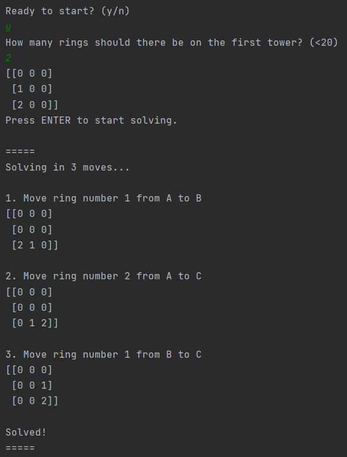

# Towers Of Hanoi
Simple solver for the classic "Towers Of Hanoi" puzzle

[Read about Towers Of Hanoi on Wikipedie](https://en.wikipedia.org/wiki/Tower_of_Hanoi)

[This project is based on this Computerphile Video](https://www.youtube.com/watch?v=8lhxIOAfDss&ab_channel=Computerphile)

### How to use?

Download the folder, run main.py and follow the instrutions.

### Example:

